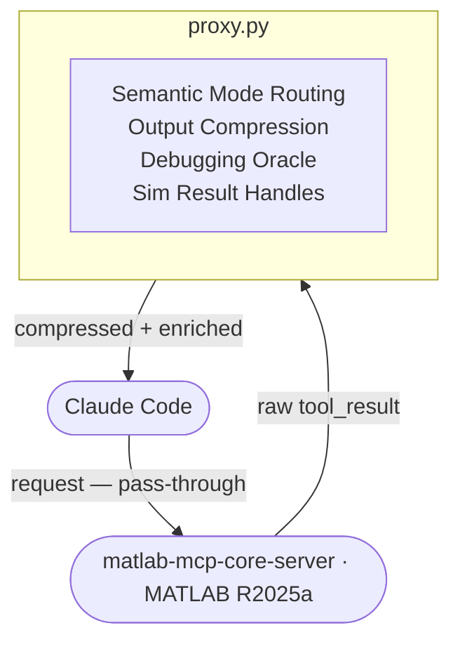

# matlab-mcp-proxy

A transparent MCP stdio proxy that compresses verbose MATLAB®, Simulink®, and Simscape® tool responses before they reach your AI agent's context window — **48–82% fewer tokens** on every tool call, with a semantic Error→Fix debugging oracle and context handles for simulation results.

> **Full documentation:** [`docs/index.html`](docs/index.html) — open locally in a browser for the complete reference with before/after examples, install guide, and all rule details.

---

## Architecture



> Full pipeline details, before/after examples, config reference: **[`docs/index.html`](docs/index.html)**

---

## Key Features

### 🔍 Error→Fix Debugging Oracle — the flagship

The most valuable feature. Every time MATLAB throws a WARNING or ERROR, the proxy embeds the message using a local sentence-transformer model (BAAI/bge-small-en-v1.5, 384-dim, CPU-only) and searches a growing knowledge base of known Simscape/Simulink errors and their fixes. When a match exceeds cosine similarity 0.79, a `[ORACLE: ...]` hint is prepended **before** the compressed error — so Claude sees the fix alongside the problem, without you having to paste it in manually.

```
[ORACLE (score=0.84): Check motor impedance parameters: if Ld/Lq are in mH
but code expects H, scale by 1e-3. Also verify the electrical frequency
is ωe = p × ω_mech, not mechanical ω.]
Warning: Matrix is singular to working precision.  [×5]
```

**The oracle grows with use.** Start with 19 included seeds covering the most common PMSM FOC and Simscape errors. After every debugging session where you figure out a fix, add it with one call:

```python
from kb.error_oracle import ErrorOracle
oracle = ErrorOracle(store_dir='kb_store/')
oracle.learn("exact MATLAB error text", "what fixed it")
```

Seed it now: `python3 tests/pmsm_foc/seed_oracle.py`

---

### 📦 Context Handles for Simulation Results

Every `sim()` result that's longer than 300 characters — typically 20+ signals across 600–800 chars — is replaced with a single-line summary handle. The full output is stored on disk and retrieved on request.

```
Before:  torque =\n\n   107.6300\n\nspeed =\n\n   6283.2\n\nid =\n\n   -12.34...
         (600 chars across 11 signals)

After:   [SimHandle#0] torque=107.6300, speed=6283.2000, id=-12.3400
```

Ask Claude `expand SimHandle#0` to retrieve the full signal data.

---

### 🔀 Semantic Mode Routing

14 compression rules applied **only where they match**. The proxy first classifies each output into one of 11 types (WHOS, ERROR, WARNING, TEST_RUN, BUILD, SIM_RESULT, PROGRESS, STRUCT, ARRAY, MODEL_QUERY, PLAIN), then runs only the relevant rules. This eliminates false positives and makes each output type — including the oracle and handles — independently extensible.

---

## Proven in a real session: PMSM FOC model build

The proxy was active while building [`PMSM_FOC_Proxy_Test.slx`](tests/pmsm_foc/PMSM_FOC_Proxy_Test.slx) — a PMSM (DQ0) FOC model built entirely through Simulink MCP using `evaluate_matlab_code` and `model_edit`. The build involved ~30 iterations of block discovery, wiring, simulation, and debugging. Here is what the proxy saved:

| Proxy feature | Firings | Tokens saved |
|---|---|---|
| Warning dedup R01 (AlgLoop ×9 per DOE run) | 9× | ~7,155 |
| whos compression R03 (after each iteration) | 12× | ~2,055 |
| Simulation context handles | 6× | ~532 |
| DOE progress compression R08 | 2× | ~310 |
| Build output R07 | 3× | ~270 |
| Struct display R10 | 7× | ~280 |
| **Total** | **48 firings** | **~10,600 tokens** |
| Oracle hints (errors caught live) | **15 firings** | ~30 min debugging saved |
| **Session reduction** | | **82%** |

The oracle fired 15 times during the build and caught real errors including: wrong electrical frequency (ω vs ωe = p×ω), bad PID parameter names, Simscape port type mismatches, IC convergence conflicts, and chained array indexing syntax issues — all before they required manual re-research.

**Try it yourself:** Open [`tests/pmsm_foc/PROMPT.md`](tests/pmsm_foc/PROMPT.md) and paste the prompt into Claude Code. It walks through building the model and shows every proxy feature firing on real MATLAB output.

---

## Results

### Quarter-car active suspension (Simscape Foundation, PD controller)

Built twice — once via `evaluate_matlab_code`, once entirely via `model_edit` from the Simulink Agentic Toolkit — identical results.

| Metric | Passive | Active | Improvement |
|---|---|---|---|
| Peak chassis velocity | 0.120 m/s | 0.046 m/s | **61.7% lower** |
| Settling time | 2.665 s | 1.761 s | **33.9% faster** |

### PMSM FOC model build session (19 oracle seeds, 9-pt DOE)

Measured during programmatic construction of `PMSM_FOC_Proxy_Test.slx` using Simulink MCP:

| Proxy feature | Firings | Chars saved | Tokens saved |
|---|---|---|---|
| whos compression (R03) | 12× | 8,220 | ~2,055 |
| Warning dedup (R01) | 9× | 28,620 | ~7,155 |
| Sim result handles | 6× | 2,130 | ~532 |
| Struct compression (R10) | 7× | 1,120 | ~280 |
| DOE progress lines (R08) | 2× | 1,240 | ~310 |
| Build output (R07) | 3× | 1,080 | ~270 |
| **Total** | **48 firings** | **42,410** | **~10,600** |
| Oracle hints | 15 firings | — | ~30 min debugging saved |
| **Session reduction** | | | **82%** |

---

## Compression rules (14 total)

| Output type | Rule | Reduction |
|---|---|---|
| `whos` variable table | R03 | **74%** |
| Repeated solver warnings | R01 | **59–71%** |
| Large array auto-display | R04 | **85%** |
| DOE / loop progress lines | R08 | **79%** |
| Algebraic loop block list | R06 | **63%** |
| Test runner output | R09 | **62%** |
| Simulink build log | R07 | **56%** |
| Struct field display | R10 | **32–52%** |
| Deep call stack | R02 | **40%** |
| `model_read` block paths | R14 | **36%** |
| Block paths in strings | R05 | varies |
| Sim error boilerplate | R11 | always |
| Redundant Caused-By | R12 | ~58% |
| Init-condition var lists | R13 | varies |
| Simulation result (context handle) | — | **71–95%** |
| **Session average** | | **48–82%** |

---

## Oracle — how the KB grows automatically

The oracle starts with 20 seeds (19 hand-crafted + 1 learned automatically in the first build session). It grows every time you use Claude Code with the proxy active.

### How it works

```
During session:
  proxy sees ERROR/WARNING → oracle has no match → logs to kb_store/pending_errors.jsonl

At session end (Stop hook fires automatically):
  kb/auto_learn.py reads pending_errors.jsonl
    ├── finds each error in the session log
    ├── locates Claude's fix explanation in the next assistant message
    ├── validates the fix worked (subsequent MATLAB call succeeded)
    └── calls oracle.learn(error, fix)  →  KB grows permanently
```

The Stop hook is already wired in `~/.claude/settings.json`. Nothing to configure — it runs silently at the end of every Claude Code session.

### Manual option

If you want to add a fix immediately without waiting for session end:

```bash
python3 kb/learn.py "exact MATLAB error text" "what fixed it"
```

### Initial seeds (20 pairs)

Covers: non-finite derivatives · algebraic loops · variable init conflicts · rate transitions · RCOND warnings · step-size-too-small · flux linkage init · undefined workspace vars · wrong PID parameter names · ωe = p×ω bug · `set_param` arg count · `simscape.addConnection` port type mismatches · double-connected ports · and more.

```bash
python3 tests/pmsm_foc/seed_oracle.py   # reload included seeds if needed
```

To see the full oracle reference: **[`docs/index.html`](docs/index.html)**

---

## Pipeline overhead (benchmark 2026-05-22)

| Path | Latency | When |
|------|---------|------|
| Non-oracle (whos, build, progress, struct…) | +0.01–0.09ms | Every non-error output |
| Error→Fix oracle query | +7ms (warm) | ERROR / WARNING only |
| Context handle store | +0.59ms | SIM_RESULT > 300 chars only |

Run `python3 tests/benchmark.py` for the full breakdown.

---

## Installation

### Requirements
- Python 3.9+
- `matlab-mcp-core-server` ([matlab/matlab-mcp-core-server](https://github.com/matlab/matlab-mcp-core-server))
- Simulink Agentic Toolkit — optional (for `model_edit`, `model_overview`)
- `pip install sentence-transformers` — optional, needed for oracle + handles only

### Quick start

```bash
git clone https://github.com/nightfury1802/matlab-mcp-proxy.git
cd matlab-mcp-proxy
bash install.sh
# Restart Claude Code
```

`install.sh` patches `~/.claude.json` to wrap both `matlab` and `simulink` servers through the proxy. A backup is created at `~/.claude.json.bak`.

```bash
bash install.sh --bypass     # proxy active, compression disabled (for debugging)
bash install.sh --uninstall  # restore direct connections
```

### Seed the oracle

```bash
python3 tests/pmsm_foc/seed_oracle.py   # loads 20 PMSM FOC + Simscape seeds
```

---

## Configuration

After running `install.sh`, `~/.claude.json` looks like this:

```json
{
  "mcpServers": {
    "matlab": {
      "command": "python3",
      "args": [
        "/path/to/matlab-mcp-proxy/proxy.py",
        "--upstream", "/path/to/matlab-mcp-core-server",
        "--initial-working-folder", "/your/work/folder",
        "--matlab-root", "/Applications/MATLAB_R2025a.app",
        "--initialize-matlab-on-startup=true"
      ],
      "env": {}, "type": "stdio"
    },
    "simulink": {
      "command": "python3",
      "args": [
        "/path/to/matlab-mcp-proxy/proxy.py",
        "--upstream", "/path/to/matlab-mcp-core-server",
        "--matlab-session-mode=existing",
        "--extension-file=/path/to/simulink-agentic-toolkit/tools/tools.json"
      ],
      "env": {}, "type": "stdio"
    }
  }
}
```

> **`~/.claude.json`** is the config for Claude Code CLI / VS Code extension.
> **`~/Library/Application Support/Claude/claude_desktop_config.json`** is for Claude Desktop.

---

## The simulink session attach problem

`--matlab-session-mode=existing` polls for a running MATLAB session for 30 seconds at startup. Without `--initialize-matlab-on-startup=true`, MATLAB starts lazily and the 30-second window expires before it's ready.

Fix: `--initialize-matlab-on-startup=true` makes MATLAB start at Claude Code launch (~15–20s), within the discovery window.

Tracked upstream at [matlab/matlab-mcp-core-server#62](https://github.com/matlab/matlab-mcp-core-server/issues/62).

---

## Testing

```bash
# Unit tests — no MATLAB needed, run in <30s
pytest tests/test_compressor.py tests/test_proxy_protocol.py \
       tests/test_router.py tests/test_oracle.py tests/test_handles.py -v
# 79 tests

# End-to-end latency benchmark
python3 tests/benchmark.py
```

**Live test with real MATLAB (PMSM FOC prompt):**
Open [`tests/pmsm_foc/PROMPT.md`](tests/pmsm_foc/PROMPT.md) and paste the prompt into Claude Code. It walks through:
1. Building `PMSM_FOC_Proxy_Test.slx` from scratch via `model_edit` + `evaluate_matlab_code`
2. Simulating and reading back a `[SimHandle#N]` instead of the full signal dump
3. Triggering an oracle hint by enabling the algebraic loop diagnostic
4. Running a 9-point speed/torque DOE and seeing `[5 lines omitted]` in the output

The reference model [`tests/pmsm_foc/PMSM_FOC_Proxy_Test.slx`](tests/pmsm_foc/PMSM_FOC_Proxy_Test.slx) is the validated end result — 9/9 DOE PASS at 0.0% torque error across 200–400 rad/s, 30–70 Nm.

The `tests/quarter_car_suspension/` folder has the original validated quarter-car Simscape model — 61.7% peak velocity reduction with active PD vs passive.

---

## When to disable compression

- You need raw numerical output to debug a result
- An error message looks truncated and you need full context

Use `bash install.sh --bypass` to keep the proxy running but skip all compression rules.

---

## Files

```
proxy.py           — MCP stdio proxy (asyncio, stdlib only)
compressor.py      — 14 compression rules
router.py          — semantic mode router, 11 output types, HTML stripping
kb/
  embedder.py      — lazy-loaded BAAI/bge-small-en-v1.5 (384-dim)
  error_oracle.py  — Error→Fix vector KB, cosine similarity threshold 0.79
  sim_handles.py   — SimHandle#N context handle store
  auto_learn.py    — Stop hook: auto-learn from session log at session end
  learn.py         — Manual CLI: python3 kb/learn.py "error" "fix"
kb_store/          — persisted oracle vectors + sim handles (20 seeds)
install.sh         — patches ~/.claude.json for matlab + simulink
tests/
  test_compressor.py       — 27 rules tests
  test_proxy_protocol.py   — 10 protocol tests
  test_router.py           — 20 classification + timing tests
  test_oracle.py           — 10 oracle + latency tests
  test_handles.py          — 12 handle + reduction tests
  benchmark.py             — end-to-end latency benchmark
  pmsm_foc/
    PMSM_FOC_Proxy_Test.slx  — validated PMSM FOC model (reference)
    build_pmsm_foc.m         — build script (recreates model from scratch)
    PROMPT.md                — user prompt for Claude Code live testing
    pmsm_error_seeds.json    — 11 PMSM FOC error→fix seeds
    seed_oracle.py           — seeds oracle KB from JSON
  quarter_car_suspension/  — Simscape validation test
docs/
  index.html       — full HTML documentation
```

| Project | Compresses | Domain rules |
|---|---|---|
| [mcp-compressor](https://github.com/atlassian-labs/mcp-compressor) | Tool descriptions/schemas | None |
| [mcp-rtk](https://github.com/ThomasTartrau/mcp-rtk) | Tool results (GitLab, Grafana) | GitLab / Grafana JSON |
| **matlab-mcp-proxy** | Tool results | **MATLAB / Simulink / Simscape + semantic KB** |

MIT — Built with Claude Code. Validated on MATLAB R2025a.
